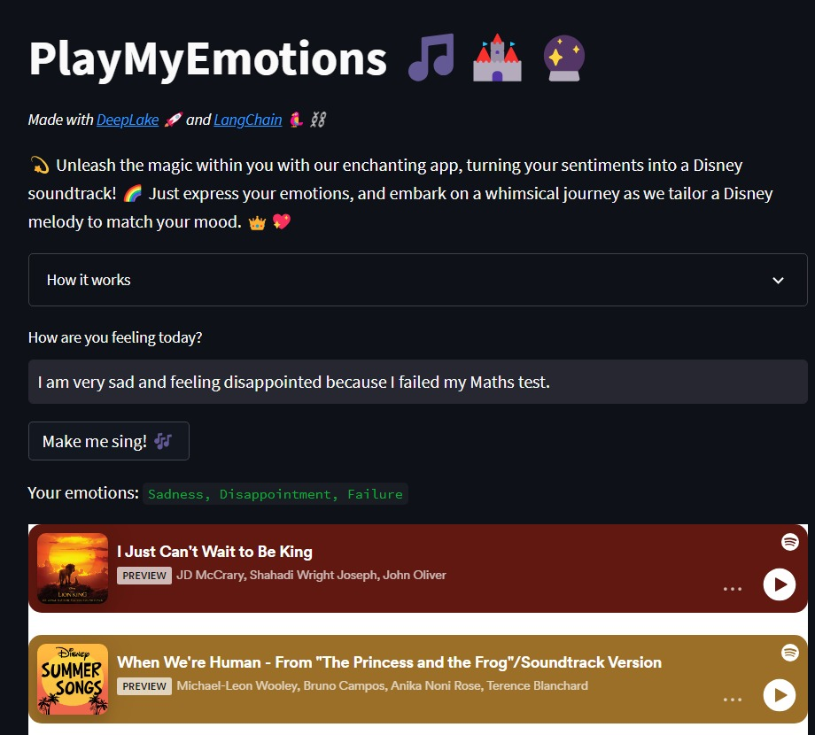

# Play My Emotions 🎵🏰🔮



The app is on [Hugging Face Spaces](https://huggingface.co/spaces/DjPapzin/PlayMyEmotions) 🤗

This app takes a user input and suggests songs that match its emotions/vibes.

Made with [DeepLake](https://www.deeplake.ai/) 🚀 and [LangChain](https://python.langchain.com/en/latest/index.html) 🦜⛓️ 

We also used [Upstash](https://upstash.com/) to store user inputs/emotions and recommended songs.

## How it works

The application follows a sequence of steps to deliver Disney songs matching the user's emotions:

- **User Input**: The application starts by collecting the user's emotional state through a text input.
- **Emotion Encoding**: The user-provided emotions are then fed to a Language Model (LLM). The LLM interprets and encodes these emotions.
- **Similarity Search**: These encoded emotions are utilized to perform a similarity search within our [vector database](Deep Lake Vector Store in LangChain). This database houses Disney songs, each represented as emotional embeddings.
- **Song Selection**: From the pool of top matching songs, the application randomly selects one. The selection is weighted, giving preference to songs with higher similarity scores.
- **Song Retrieval**: The selected song's embedded player is displayed on the webpage for the user. Additionally, the LLM-interpreted emotional state associated with the chosen song is displayed.

## Run it

Clone this repo.

Create a `venv`:

```bash
python -m venv .venv
source .venv/bin/activate
pip install -r requirements.txt
